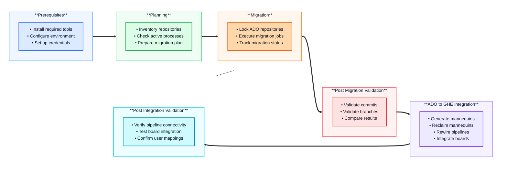

# 🚀Orchestrating Azure DevOps to GitHub Enterprise Migration Using ADO2GH Extension

*Published: May 19, 2026*

---

## 🧭 Overview

Migrating from **Azure DevOps (ADO)** to **GitHub Enterprise (GHE)** is a complex undertaking that requires careful planning, execution, and validation. While manual migration is possible for a handful of repositories, organizations with dozens or hundreds of repositories need an automated, repeatable, and traceable approach.

This article introducing the **ADO2GH Migration PowerShell Scripts** - a **collection of modular automation scripts** purpose-built to simplify, orchestrate, and validate each stage of the migration journey, from initial preparation to final post-migration checks.

---

## 🗂️Table of Contents

- [Prerequisites: Setting Up Your Environment](#prerequisites-setting-up-your-environment)
- [Defining Personal Access Token Scopes](#defining-personal-access-token-scopes)
- [Understanding the Migration Workflow](#understanding-the-migration-workflow)
- [Configure parameters in the config file](#configure-parameters-in-the-config-file)
- [Verify Environment Setup](#verify-environment-setup)
- 🧾[Script 0: Inventory Script (0_Inventory.ps1)](#script-0-inventory-script-0_inventoryps1)
- 🧾[Script 1: Active Process Check (1_check_active_process.ps1)](#script-1-active-process-check-1_check_active_processps1)
- 🧾[Script 2: Repository Migration (2_migrate_repo.ps1)](#script-2-repository-migration-2_migrate_repops1)
- 🧾[Script 3: Migration Validation (3_migration_validation.ps1)](#script-3-migration-validation-3_migration_validationps1)
- 🧾[Script 4: Generate Mannequins (4_generate_mannequins.ps1)](#script-4-generate-mannequins-4_generate_mannequinsps1)
- 🧾[Script 5: Reclaim Mannequins (5_reclaim_mannequins.ps1)](#script-5-reclaim-mannequins-5_reclaim_mannequinsps1)
- 🧾[Script 6: Rewire Pipelines (6_rewire_pipelines.ps1)](#script-6-rewire-pipelines-6_rewire_pipelinesps1)
- 🧾[Script 7: Integrate Boards (7_integrate_boards.ps1)](#script-7-integrate-boards-7_integrate_boardsps1)
- 🧾[Script 8: Disable ADO Repositories (8_disable_ado_repos.ps1)](#script-8-disable-ado-repositories-8_disable_ado_reposps1)
- [Reconfigure your local repository](#reconfigure-your-local-repository)

---

## 🧰Prerequisites: Setting Up Your Environment

Before you can run any script in this migration suite, you need to ensure your environment is properly configured. This section covers all the tools, permissions, and configuration required.

### Required Tools and Software

#### 1. PowerShell 7.0 or Later

The migration scripts are built on PowerShell 7+ to leverage cross-platform capabilities and modern scripting features.

**Installation:**
```powershell
# Windows (using winget)
winget install Microsoft.PowerShell

# Or download from: https://github.com/PowerShell/PowerShell/releases
```

**Verify Installation:**
```powershell
$PSVersionTable.PSVersion
# Should show version 7.0 or higher
```

#### 2. GitHub CLI (gh)

The GitHub CLI is essential for interacting with GitHub repositories, organizations, and the ADO2GH extension.

**Installation:**
```powershell
# Windows (using winget)
winget install GitHub.cli

# Or download from: https://cli.github.com/
```

**Verify Installation:**
```powershell
gh --version
# Should show gh version 2.x or higher (tested on 2.92.0 (2026-04-28))
```

**Authentication:**
```powershell
# Authenticate with your GitHub Enterprise instance
gh auth login --hostname github.com

# Follow the prompts to complete authentication
```

#### 3. Azure CLI (az)

The Azure CLI is used for querying Azure DevOps resources, checking pipeline status, and managing service connections.

**Installation:**
```powershell
# Windows (using winget)
winget install Microsoft.AzureCLI

# Or download from: https://docs.microsoft.com/cli/azure/install-azure-cli
```

**Verify Installation:**
```powershell
# Should show azure-cli version 2.x or higher (tested on:  2.86.0)
az --version
```

**Azure DevOps Extension:**
```powershell
# Add the Azure DevOps extension to Azure CLI
az extension add --name azure-devops

# Verify the extension is installed
az extension list --output table
```

#### 4. GitHub ADO2GH Extension

This is the critical tool that enables repository migration from Azure DevOps to GitHub.

**Installation:**
```powershell
# Install the ADO2GH extension for GitHub CLI
gh extension install github/gh-ado2gh

# Verify installation
gh extension list
```

**Keeping Extensions Updated:**
```powershell
# Update the ADO2GH extension to the latest version
gh extension upgrade gh-ado2gh

# Or update all extensions
gh extension upgrade --all
```

---

## 🔐Defining Personal Access Token Scopes

### Azure DevOps Personal Access Token

The ADO_PAT token is used to authenticate with Azure DevOps and perform operations on repositories, pipelines, Azure Boards, Service connections and projects.

To generate the Azure DevOps inventory report, a PAT with full access or elevated administrator privileges is mandatory. This is a one-time requirement used solely for inventory generation.

💡 _Tip:_ You can minimize risk by setting the token expiration to **less than one day** for this step.

**Recommended PAT Scopes for Migration:**
- `Analytics: Read`
- `Build: Read`
- `Code: Full` (required for disabling ADO repositories)
- `GitHub Connections: Read & Manage`
- `Graph: Read`
- `Identity: Read`
- `Pipeline Resources: Use`
- `User Profile: Read`
- `Project and Team: Read`
- `Release: Read`
- `Security: Manage`
- `Service Connections: Read & Query`
- `Work Items: Read`

**Creating the Token:**
1. Navigate to Azure DevOps: `https://dev.azure.com/{your-org}`
2. Click on **User Settings** (top-right) → **Personal Access Tokens**
3. Click **+ New Token**
4. Set an expiration date (consider your migration timeline)
5. Select **Full Access** for inventory report generation or specific scopes listed above
6. Click **Create** and **copy the token immediately**

**Setting the Environment Variable:**
```powershell
# Windows PowerShell (current session)
$env:ADO_PAT="your-ado-pat-token-here"

# Windows PowerShell (persistent)
[System.Environment]::SetEnvironmentVariable('ADO_PAT', 'your-ado-pat-token-here', 'User')

# Verify it's set
# Windows PowerShell (current session)
$env:ADO_PAT

# Windows PowerShell (persistent)
[System.Environment]::GetEnvironmentVariable('ADO_PAT', 'User')

```

⚠️ **Security Best Practice:** PAT tokens function much like passwords, so they must be handled and stored with extreme caution. 
Never commit PAT tokens to version control. Always store them securely using a password manager, environment variable, or a secret management tool (such as Azure Key Vault or GitHub Secrets).

### GitHub Personal Access Token
We need two tokens here, with names `GH_PAT` and `GH_BoardsPAT`.

The `GH_PAT` token authenticates with GitHub Enterprise and is required for organization-level operations.

**Required Scopes:**
- `repo` - Full control of private repositories
- `workflow` - Update GitHub Actions workflows
- `admin:org` - Full control of organizations and teams
- `user:read` - Read user profile data
- `user:email` - Access user email addresses
- `delete_repo` — Delete repositories (optional, for rollback scenarios)
- `write:discussion` - Create and manage discussions

> ℹ️ Info: The value from this token should bne assigned to environment variable `GH_PAT`


**Creating the Token:**
1. Navigate to GitHub Settings: `https://github.com/settings/tokens`
2. Click **Generate new token** → **Generate new token (classic)**
3. Give it a descriptive name (e.g., "ADO Migration Tool")
4. Set an expiration (consider your migration timeline)
5. Select all the scopes listed above
6. Click **Generate token** and **copy it immediately**

**Setting the Environment Variable:**
```powershell
# Windows PowerShell (current session)
$env:GH_PAT="your-github-pat-token-here"
# Verify it's set
$env:GH_PAT

# Windows PowerShell (persistent)
[System.Environment]:SetEnvironmentVariable('GH_PAT', 'your-github-pat-token-here', 'User')

# Verify it's set
# Windows PowerShell (persistent)
[System.Environment]::GetEnvironmentVariable('GH_PAT', 'User')
```

The `GH_BoardsPAT` token will be used only for Azure boards to GitHub integrations. This token will be used after Step 6.
For this token there is a limited scope and should be **exactly as it** is shown below:

**Required Scopes:**
- `repo` - Full control of private repositories
- `admin:repo_hook` - Full control of organizations and teams
- `user:read` - Read user profile data
- `user:email` - Access user email addresses

> ℹ️ Info: The value from this token should be assigned to environment variable `GH_BoardsPAT`

**Setting the Environment Variable:**
```powershell
# Windows PowerShell (current session)
$env:GH_BoardsPAT="your-github-pat-token-here"
# Verify it's set
$env:GH_BoardsPAT

# Windows PowerShell (persistent)
[System.Environment]::SetEnvironmentVariable('GH_BoardsPAT', 'your-github-pat-token-here', 'User')
# Verify it's set

# Windows PowerShell (persistent)
[System.Environment]::GetEnvironmentVariable('GH_BoardsPAT', 'User')
```

---
## 🧭Understanding the Migration Workflow

Before jumping into the scripts, let’s walk through the migration workflow to see how each step fits into the overall process.




### Comprehensive Migration Workflow

The **ADO to GitHub migration process** is structured as a **nine-step sequential workflow**, where each step builds upon the previous one to ensure a smooth and validated migration:

## 🔄 Script Sequence
```
┌─────────────────────────────────────────────────────────────┐
│                  ADO to GitHub Migration Flow               │
└─────────────────────────────────────────────────────────────┘

Step 0: Generate Inventory
         ├─ Scan ADO organization
         ├─ Generate repos.csv, pieplines.csv, orgs.csv, team-project.csv
                      ⬇️
Step 1: Check Active Processes
         ├─ Read from repos.csv OR use -Repository parameters
         ├─ Check for in-progress pipelines per repo
         ├─ Check for active pull requests per repo
         └─ Generate ready/blocked repository report (CONSOLE OUTPUT ONLY)
                      ⬇️
         [MANUAL STEP: Filter repos.csv based on console output if needed]
                      ⬇️
Step 2: Migrate Repository (Parallel Execution)
         ├─ Read from repos.csv input file 
         ├─ Lock ADO repository
         ├─ Execute migration to GitHub (parallel jobs)
         ├─ Track success/failure per repository
         └─ Generate migration state file
                      ⬇️
Step 3: Migration Validation
         ├─ Read from migration state file
         ├─ Validate ADO source (commits, branches)
         ├─ Validate GitHub target (commits, branches)
         ├─ Compare results
         └─ Update state file with validation results
                      ⬇️
Step 4: Generate Mannequins
         └─ Creates CSV of placeholder user accounts (org-wide)
                      ⬇️
Step 5: Reclaim Mannequins
         └─ Map mannequins to actual GitHub users
                      ⬇️
Step 6: Rewire Pipelines
         ├─ Read from migration state file (for repo mappings)
         ├─ Read pipelines from pipelines.csv (PRIMARY INPUT)
         ├─ Validate service connections per project
         ├─ Skip Classic pipelines (manual rewiring required)
         ├─ Skip already-rewired pipelines
         └─ Rewire YAML pipelines to GitHub repos
                      ⬇️
Step 7: Integrate Boards
         ├─ Read from repos.csv (PRIMARY INPUT)
         ├─ Check for existing GitHub Boards connections
         ├─ Skip projects with existing connections
         └─ Integrate Azure Boards with GitHub repos
                      ⬇️
Step 8: Disable ADO Repositories
         ├─ Read from migration state file
         ├─ Confirm user intent
         ├─ Disable each ADO repository
         └─ Generate disable report
```

---
## 🪛Configure parameters in the config file

The migration scripts use a centralized configuration file (`migration-config.json`) to manage settings consistently across all scripts.

**Create the Configuration File:**

1. Navigate to the `scripts` directory in your migration workspace
2. Copy the sample configuration file:

```powershell
cd scripts
Copy-Item migration-config.json.sample migration-config.json
```

3. Edit `migration-config.json` with your organization details:

```json
{
  "adoOrganization": "your-ado-org-name",
  "githubOrganization": "your-github-org-name",
  "scripts": {
    "inventory": {
      "adoOrg": "your-ado-org-name"
    },
    "checkActiveProcess": {
      "repoCSV": "repos.csv"
    },
    "migrateRepo": {
      "repoCSV": "repos.csv",
      "maxConcurrentJobs": 4,
      "pollingIntervalSeconds": 15,
      "jobTimeoutMinutes": 20
    },
    "generateMannequins": {
      "outputCSV": "mannequins.csv"
    },
    "reclaimMannequins": {
      "inputCSV": "mannequins.csv",
      "skipInvitation": false
    },
    "rewirePipelines": {
      "stateFile": "auto",
      "pipelinesCSV": "pipelines.csv"
    },
    "disableAdoRepos": {
      "stateFile": "auto"
    }
  }
}
```

**Configuration Parameters Explained:**

| Parameter | Description | Example |
|-----------|-------------|---------|
| `adoOrganization` | Your Azure DevOps organization name | `contosodevopstest` |
| `githubOrganization` | Your target GitHub organization | `ADO2GH-Migration` |
| `scripts.inventory.adoOrg` | ADO org for inventory generation | `contosodevopstest` |
| `scripts.migrateRepo.maxConcurrentJobs` | Parallel migration limit | `4` (max 5 per GitHub) |
| `scripts.migrateRepo.repoCSV` | Input CSV file for migration | `repos.csv` (from inventory report) |

---

## 🔍Verify Environment Setup

Before running the inventory script, validate that everything is configured correctly:

```powershell
# 1. Check PowerShell version
$PSVersionTable.PSVersion

# 2. Check GitHub CLI authentication
gh auth status

# 3. Check Azure CLI installation
az --version

# 4. Check ADO2GH extension
gh extension list | Select-String "ado2gh"

# 5. Verify environment variables are set
Write-Host "ADO_PAT: $($env:ADO_PAT -ne $null)" -ForegroundColor $(if($env:ADO_PAT) {"Green"} else {"Red"})
Write-Host "GH_PAT: $($env:GH_PAT -ne $null)" -ForegroundColor $(if($env:GH_PAT) {"Green"} else {"Red"})

# 6. Authenticate to Azure Devops with your newly created token.

# At the Token prompt - paste in the same token that was the value for your ADO_PAT. The console will not show any response here.
az devops login

# 6. Test Azure DevOps connectivity
az devops project list --org "https://dev.azure.com/your-ado-org"

# 7. Test GitHub connectivity
gh repo list your-github-org --limit 5
```

If all checks pass, you're ready to proceed! ✅

---

## 🧾Script 0: Inventory Script (0_Inventory.ps1)

📝 **Description:**
 
This script generates an inventory report of Azure DevOps repositories at the organization level using the gh ado2gh CLI extension. This report is used to identify repositories for migration planning.

🧰 **Prerequisites:**
- **ADO_PAT** environment variable set with full access scope
- `migration-config.json` exists with proper configuration

⚡ **Commands Used:**
- GitHub CLI extension `gh ado2gh` : `gh ado2gh inventory-report --ado-org $AdoOrg`
  
🔧 **Parameters:**
- Config location: `migration-config.json` → `scripts.inventory.adoOrg`

💻 **Script Usage:**
- Run with default settings: `.\0_Inventory.ps1` 
- Use a custom configuration file: `.\0_Inventory.ps1 -ConfigPath "custom-config.json"`

⚙️ **Order of operations:**
- **[1/3]** Validate **ADO PAT** tokens.
- **[2/3]** Load configuration from `migration-config.json` with parameter overrides
  - Reads `adoOrganization` from `config.scripts.inventory.adoOrg`
- **[3/3]** Generate inventory report using **gh ado2gh** CLI

**🗂️ Output Files Generated:**
- Contains the list of **Azure DevOps organizations**: `orgs.csv`
- Captures all **team projects** within each organization: `team-projects.csv`
- Lists all **repositories** (used as input for subsequent scripts): `repos.csv`
- Enumerates all **pipeline**s associated with the **projects**: `pipelines.csv`
- Each `gh ado2gh` command within the script produces detailed logs.

---
## 🧾Script 1: Active Process Check (1_check_active_process.ps1)


📝 **Description:** 

This script checks for active processes **(pipelines and PRs)** on ADO repositories before migration. It should be run **BEFORE** starting the migration to ensure repositories are ready for migration.

🧰 **Prerequisites:**
- Configure the **ADO PAT** token as an environment variable with full access permissions.
- `migration-config.json` exists with proper configuration
- `repos.csv` file (generated by `0_Inventory.ps1`)

⚡ **Commands Used:**
- Check for in-progress pipelines in a team project:`az pipelines runs list --project $TeamProject --status inProgress`
- Check for active pull requests in a repository: `az repos pr list --project $TeamProject --repository $Repository --status active`

🔧 **Parameters:**
- The script reads the value of `config.scripts.checkActiveProcess.repoCSV` from `migration-config.json`
- That value is the CSV file path (like `repos.csv`)

💻 **Script Usage:**
- Check all repos reading from `repo.csv` generated from inventory report.
`.\1_check_active_process.ps1` 
- Check specific projects
`.\1_check_active_process.ps1 -TeamProject "project"`

⚙️ **Order of operations:**
- **[1/5]** Validate ADO PAT tokens. 
- **[2/5]** Load configuration from `migration-config.json`
- **[3/5]** Normalize repository input from parameters or CSV file
- **[4/5]** Check active processes **(pipelines and PRs)** for each repository
- **[5/5]** Summarize results and provide next steps

**🗂️ Output Files generated:**

*Displays output to the console (progress messages, results, summary)*

---

## 🧾Script 2: Repository Migration (2_migrate_repo.ps1)

📝 **Description:** 

This script performs large-scale repository migration from Azure DevOps to GitHub Enterprise with parallel processing and state tracking. It migrates repositories in batches while maintaining detailed logs for follow-up actions.


🧰 **Prerequisites:**
- Set the **ADO_PAT** and **GH_PAT** environment variables with their respective Personal Access Tokens.
- `repos.csv` (or configured CSV path) with 5 required columns: `org`, `teamproject`, `repo`, `ghorg`, `ghrepo`
- `migration-config.json` configuration file
- **Maximum 5 concurrent migrations** per organization (enforced by GitHub). Script respects this limit with the `$MaxParallelJobs` parameter (default: 5)
- Ideally, `1_check_active_process.ps1` should be executed first to verify that there are no active **pipelines** or **pull requests**.

⚡ **Commands Used:**
- `gh ado2gh lock-ado-repo`
- `gh ado2gh migrate-repo`
- `gh ado2gh wait-for-migration`

🔧 **Parameters:**
- The script reads the value of `config.scripts.migrateRepo.repoCSV` from `migration-config.json`
- That value is the CSV file path (like `repos.csv`)

💻 **Script Usage:**
- Reads **repos.csv** from `migration-config.json` settings: `.\2_migrate_repo.ps1`
- Override the default CSV file path specified in `migration-config.json`: `.\2_migrate_repo.ps1 [-RepoCSV "repos.csv"]`
- Limit parallel migrations (**default: 5, GitHub's maximum concurrent limit**): `.\2_migrate_repo.ps1 [-MaxParallelJobs 3]`

⚙️ **Order of operations:**
- **[1/5]** Validate PAT tokens (ADO_PAT and GH_PAT environment variables)
- **[2/5]** Load configuration from `migration-config.json` with parameter overrides
- **[3/5]** Load repository data from CSV file with required columns (`org`, `teamproject`, `repo`, `ghorg`, `ghrepo`)
- **[4/5]** Execute batched migrations (respects GitHub's 5 concurrent migration limit)
   - **Queue all repos** → `$pendingRepos`
  - **Start initial batch** *(max 5 concurrent)*
  - **For each repo:**
    - Lock ADO repo
    - Queue migration → `gh ado2gh wait-for-migration`
    - Extract Migration ID
    - Start monitoring job
  - **Monitor loop**
    - Check job completion
    - Record results
    - Start next pending migration
  - **Wait for all jobs to complete**

- **[5/5]** Generate **state file** and display **summary** with next steps.

**🗂️ Output Files generated:**
- state file for automation and follow-up scripts: `migration-state-comprehensive-YYYYMMDD-HHMMSS.json`
- detail CSV log with `MigrationId` and `GitHubRepoUrl` for analysis: `migration-log-YYYYMMDD-HHMMSS.csv`
- Each `gh ado2gh` command within the script produces detailed logs.

---
## 🧾Script 3: Migration Validation (3_migration_validation.ps1)


📝 **Description:** 


This script validates migrated repositories by retrieving data from both **ADO** source and **GitHub** target. It uses the state file generated by `2_migrate_repo.ps1` to identify repositories to validate. Provides informational comparison of commit and branch counts between systems.

🧰 **Prerequisites:**
- GitHub CLI (gh) installed and authenticated
- Set the ADO_PAT and GH_PAT environment variables with their respective Personal Access Tokens.
- State file from `2_migrate_repo.ps1` (`migration-state-comprehensive-*.json`)

⚡ **Commands Used:**
- Get GitHub commit count (via Link header pagination): `gh api "/repos/$GitHubOrg/$GitHubRepo/commits?per_page=1" --include`
- GitHub commits when no pagination (small repos): `gh api "/repos/$GitHubOrg/$GitHubRepo/commits?per_page=100"`
- Get GitHub branch count: `gh api "/repos/$GitHubOrg/$GitHubRepo/branches?per_page=100"`
- ADO Commits API: `https://dev.azure.com/$AdoOrg/$EncodedProject/_apis/git/repositories/$EncodedRepo/commits?api-version=7.0`
- ADO Branches API: `https://dev.azure.com/$AdoOrg/$EncodedProject/_apis/git/repositories/$EncodedRepo/refs?filter=heads/&api-version=7.0`

🔧 **Parameters:**
- read the variables `AdoOrganization`, `AdoTeamProject`, `AdoRepository`, `GitHubOrganization`, `GitHubRepository` from the state file generated by `2_migrate_repo.ps1`
- Reads: `config.scripts.validation.stateFile` → State file path and Uses state file only
 
💻 **Script Usage:**
- Automatically finds and uses the latest migration-state-comprehensive-*.json file: `.\3_migration_validation.ps1`
- for multiple migration state files and want to validate a specific one: `.\3_migration_validation.ps1 -StateFile "migration-state-comprehensive-YYYYMMDD-HHMMSS.json"`

⚙️ **Order of operations:**
- **[1/3]** Load migration state file from `2_migrate_repo.ps1`
  - Auto-discovers latest state file if not specified
  - Creates timestamped log file for transcript
- **[2/3]** Validate each repository (ADO source and GitHub target)
  - Queries **ADO REST API** for commit and branch counts
  - Queries **GitHub API** via **gh cli** for **commit** and **branch counts**
  - Displays side-by-side comparison (informational only)
- **[3/3]** Update state file with validation results
  - Adds `ValidationResults`, `ValidationTimestamp`, `ValidationSummary`
  - Modifies original state file in-place (same filename)


**🗂️ Output Files generated:**
- Updated state file with validation results (commit/branch counts from both systems): `migration-state-comprehensive-YYYYMMDD-HHMMSS.json`
- Console display showing side-by-side comparison
- Timestamped log file: `validation-log-YYYYMMDD-HHmmss.txt`

---
## 🧾Script 4: Generate Mannequins (4_generate_mannequins.ps1)

📝 **Description:** 

This script generates a CSV file of **mannequin users** (placeholder accounts) that were created during the migration process. This CSV is used in the next step to reclaim and map these mannequins to actual GitHub users.


🧰 **Prerequisites:**

- Configure the **GH PAT** token as an environment variable with full access permissions.
- Repositories must be migrated first (run `2_migrate_repo.ps1`)
- `migration-config.json` configuration file

⚡ **Commands Used:**
- `gh ado2gh generate-mannequin-csv --github-org $GITHUB_ORG --output $OUTPUT_FILE`

🔧 **Parameters:**
- The script reads the value of `config.scripts.generateMannequins.outputCSV` and `config.githubOrganization` from `migration-config.json`
- That value is the CSV file path (like `mannequins.csv`)

💻 **Script Usage:**
- Uses settings from `migration-config.json` (default output: **mannequins.csv**): `.\4_generate_mannequins.ps1`
- Use a custom configuration file: `.\4_generate_mannequins.ps1 [-ConfigPath "migration-config.json"]`
- Generate **mannequins** to a custom CSV file location: `.\4_generate_mannequins.ps1 [-OutputCSV "custom-mannequins.csv"]`

⚙️ **Order of operations:**
- **[1/3]** Validate GitHub PAT token
- **[2/3]** Load configuration from `migration-config.json`
- **[3/3]** Generate `mannequin.csv` using **gh ado2gh CLI**

**🗂️ Output Files generated:**
- list of placeholder users requiring GitHub mapping: cmannequins.csv`
- Each `gh ado2gh` command within the script produces detailed logs. 

---
## 🧾Script 5: Reclaim Mannequins (5_reclaim_mannequins.ps1)
📝 **Description:** 

This script reclaims **mannequin** users (placeholder accounts) by mapping them to actual **GitHub user accounts**. The **mannequins CSV** should be updated with target **GitHub usernames** before running this script.

🧰 **Prerequisites:**
- Configure the **GH PAT** token as an environment variable.
- Script 4 (`4_generate_mannequins.ps1`) has been run to generate `mannequins.csv`
- **Mannequins CSV** has been reviewed and updated with **target GitHub usernames**
- `migration-config.json` exists with proper configuration

⚡ **Commands Used:**
- `gh ado2gh reclaim-mannequin --github-org $GITHUB_ORG --csv $CSV_FILE`

🔧 **Parameters:**
- The script reads the value of `config.scripts.reclaimMannequins.inputCSV` and `config.githubOrganization` from `migration-config.json`
- That value is the CSV file path (like `mannequins.csv`)

💻 **Script Usage:**
- Uses settings from `migration-config.json` (default input: mannequins.csv): `.\5_reclaim_mannequins.ps1`
- Use a custom CSV file location instead of the default: `.\5_reclaim_mannequins.ps1 -MannequinsCSV "custom-mannequins.csv"`

⚙️ **Order of operations:**
- **[1/4]** Validate **GitHub PAT** token
- **[2/4]** Load migration configuration from `migration-config.json`
- **[3/4]** Validate `mannequins.csv` file exists and contains data
- **[4/4]** Execute mannequin reclaims using **gh ado2gh CLI**

**🗂️ Output Files generated:**
- default verbose output file by the extension **ado2gh CLI**
- Each `gh ado2gh` command within the script produces detailed logs.

---
## 🧾Script 6: Rewire Pipelines (6_rewire_pipelines.ps1)
📝 **Description:** 

This script **rewires Azure DevOps pipelines** to use the new **GitHub repositories**. It reads pipeline inventory from `pipelines.csv` and updates **YAML pipelines** to point to the corresponding GitHub repositories using a service connection.

🧰 **Prerequisites:**
- Set the **ADO_PAT** and **GH_PAT** environment variables with their respective Personal Access Tokens.
- **GitHub service connection** configured in **Azure DevOps**
- Migration state file from `2_migrate_repo.ps1`
- `pipelines.csv` from `0_Inventory.ps1`
- `migration-config.json` exists with proper configuration

⚡ **Commands Used:**
- `az pipelines show --org "https://dev.azure.com/$ADO_ORG" --project "$projectName" --id $pipelineId -o json`
- `gh ado2gh rewire-pipeline --dry-run`
- `gh ado2gh rewire-pipeline`

🔧 **Parameters:**
- `$StateFile` read from `migration-config.json`
- `AdoOrganization`; `AdoTeamProject`; `AdoRepository`; `GitHubOrganization`; `GitHubRepository` are read from `pipelines.csv` file generated by the inventory script.

💻 **Script Usage:**
- finds the latest migration state file and uses default settings: `.\6_rewire_pipelines.ps1`
- If you want to use a specific one state file: `.\6_rewire_pipelines.ps1 -StateFile "migration-state-YYYYMMDD-HHMMSS.json"`
- custom config path: `.\6_rewire_pipelines.ps1 -ConfigPath "custom-config.json"`

⚙️ **Order of operations:**
- **[1/7]** Validate PAT tokens (**ADO_PAT** and **GH_PAT**)
- **[2/7]** Load configuration from `migration-config.json` with parameter overrides
- **[3/7]** Load **migration state file** with successfully migrated repositories
- **[4/7]** Load pipeline inventory from `pipelines.csv` (source of truth)
- **[5/7]** Process pipelines from inventory:
  - Query pipeline details (YAML vs Classic, already on GitHub)
  - Skip **Classic pipelines** (require manual rewiring)
  - Skip **pipelines** already rewired to **GitHub**
  - Map **ADO repo** to **GitHub repo** using migration state
- **[6/7]** Validate **service connections** per project:
  - Query **GitHub service connections** for each project
  - Test connection authentication with dry-run
  - Exclude **projects** with no connections or invalid credentials
- **[7/7]** **Rewire pipelines** using project-specific service connections

**🗂️ Output Files generated:**
- detailed rewiring log: `pipeline-rewiring-log-YYYYMMDD-HHMMSS.txt`
- Each `gh ado2gh` command within the script produces detailed logs.

---
## 🧾Script 7: Integrate Boards (7_integrate_boards.ps1)
📝 **Description:** 

This script integrates **Azure Boards**  with the **migrated GitHub repositories**. It reads repository inventory from `repos.csv` and integrates each repository with **Azure Boards** for cross-platform **workItem** linking.

🧰 **Prerequisites:**
- Set the **ADO_PAT** and **GH_PAT** environment variables with their respective Personal Access Tokens.
- `repos.csv` from `0_Inventory.ps1`
- Repositories already migrated to GitHub
- For **Boards integration**, ensure the GitHub Personal Access Token includes the required scopes: `repo`; `admin:repo_hook`; `read:user`; `user:email`;

⚡ **Commands Used:**
- `gh ado2gh integrate-boards`
- ADO GitHub Connections API, Check for existing GitHub Boards connections to prevent VS403674 conflicts: `https://dev.azure.com/$adoOrg/$adoTeamProject/_apis/githubconnections?api-version=7.2-preview`


🔧 **Parameters:**
- Config location: `$StateFile` read from `migration-config.json`
- `$ReposFile` → Repository inventory CSV file path (default: `repos.csv`)
- `org`, `teamproject`, `repo`, `ghorg`, `ghrepo` columns read from the `repos.csv`

💻 **Script Usage:**
- Uses repos.csv from the current directory (generated by 0_Inventory.ps1): `.\7_integrate_boards.ps1`
- Specify a different CSV file with repository information: `.\7_integrate_boards.ps1 -ReposFile "custom-repos.csv"`

⚙️ **Order of operations:**
- **[1/5]** Validate PAT tokens (**ADO_PAT** and **GH_PAT**)
- **[2/5]** Load repository inventory from `repos.csv` (source of truth)
- **[3/5]** Check for existing **GitHub connections** (prevent VS403674 error)
- **[4/5]** **Integrate boards** for each repository
- **[5/5]** Generate integration **summary and log**

**🗂️ Output Files generated:**
- detailed integration log: `boards-integration-log-YYYYMMDD-HHmmss.txt`
- Each `gh ado2gh` command within the script produces detailed logs.

---

## 🧾Script 8: Disable ADO Repositories (8_disable_ado_repos.ps1)
📝 **Description:** 

This script disables **Azure Devops repositories** after successful migration and validation. It prevents further changes to the source repositories.

🧰 **Prerequisites:**
- Set the **ADO_PAT** and **GH_PAT** environment variables with their respective PAT.
- Repositories must be successfully migrated (Step 2 - `2_migrate_repo.ps1`)
- Repositories must be validated (Step 3 - `3_migration_validation.ps1`)
- **Migration state file** from `2_migrate_repo.ps1` must exist
- `migration-config.json` configuration file

⚡ **Commands Used:**
- `gh ado2gh disable-ado-repo`

🔧 **Parameters:**
- $StateFile -> read from migration-config.json
- AdoOrganization; AdoTeamProject; AdoRepository; GitHubOrganization; GitHubRepository are read from statefile.

💻 **Script Usage:**
- latest migration state file and uses default configuration: `.\8_disable_ado_repos.ps1`
- provide a customer statefile: `.\8_disable_ado_repos.ps1 -StateFile "migration-state-20251027-124627.json"`
- Specify a different `migration-config.json` file: `.\8_disable_ado_repos.ps1 -ConfigPath "custom-config.json"`

⚙️ **Order of operations:**
- **[1/4]** Validate **ADO_PAT** and **GH_PAT** PAT tokens
- **[2/4]** Load configuration from `migration-config.json` with parameter overrides
- **[3/4]** Load repository information from **migration state file**
- **[4/4]** **Disable ADO** repositories (with user confirmation)
  - Display warning about destructive operation
  - Request explicit user confirmation
  - Disable each repository using `gh ado2gh disable-ado-repo`
  - Generate disable report

**🗂️ Output Files generated:**
- repository disable report with audit trail: `disable-report-YYYYMMDD-HHmmss.md`
- Each `gh ado2gh` command within the script produces detailed logs.

---

## 🔧Reconfigure your local repository

After successfully migrating the repositories and completing all integrations, developers need to reconfigure their local repositories to point to the new GitHub repository as the remote origin. This can be done by running the commands below.

- Check your curent remotes with: `git remote -v`
- Change the remote URL for the origin remote to the GitHub repository using this command: `git remote set-url origin <GitHub_repository_URL>`
- The command used to list all the remote branches available in the remote repository named origin: `git ls-remote --heads origin`

---


